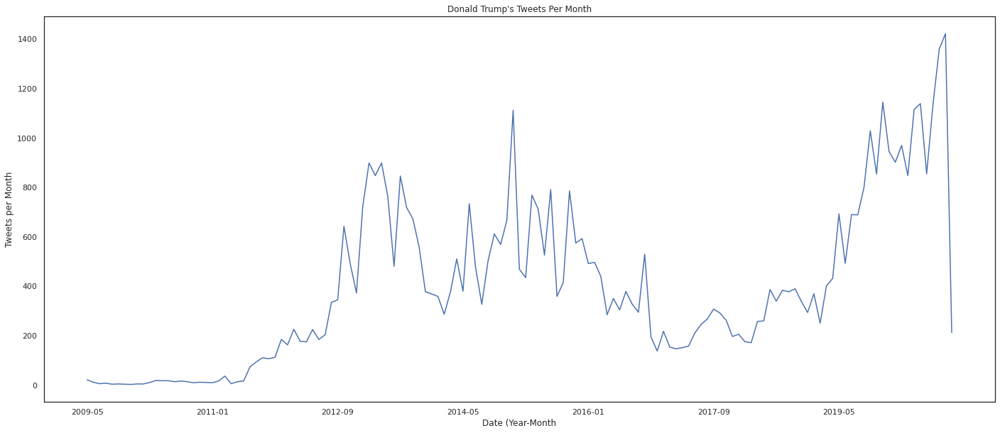
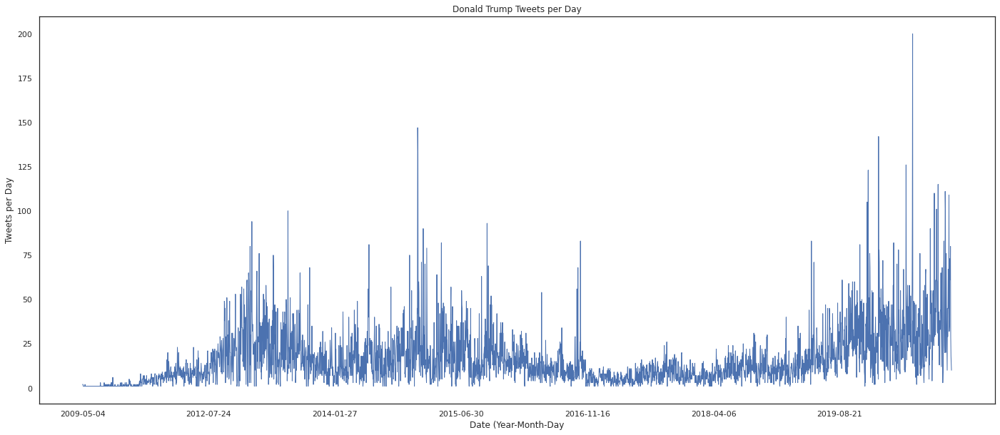
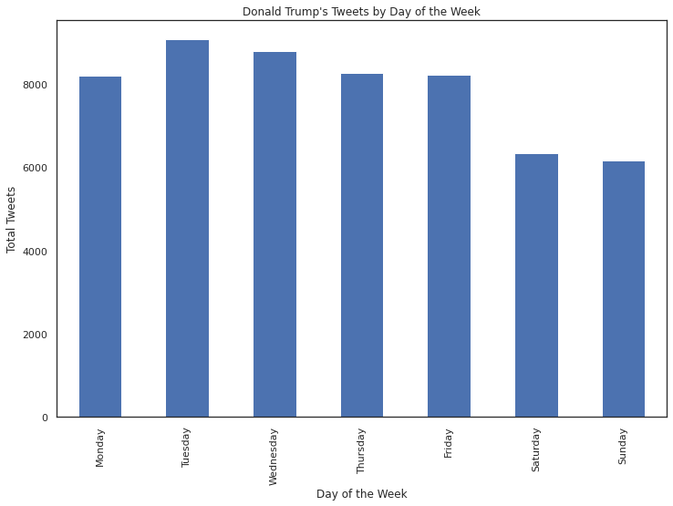
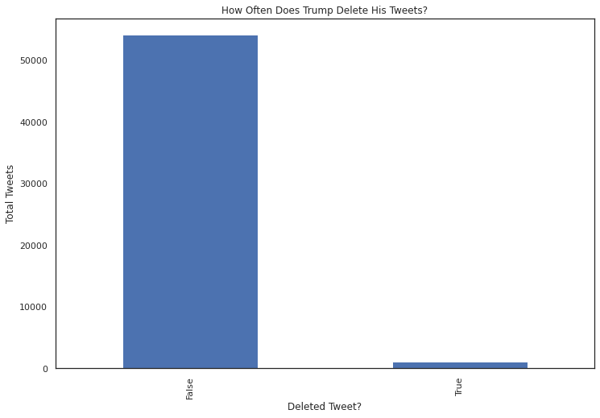
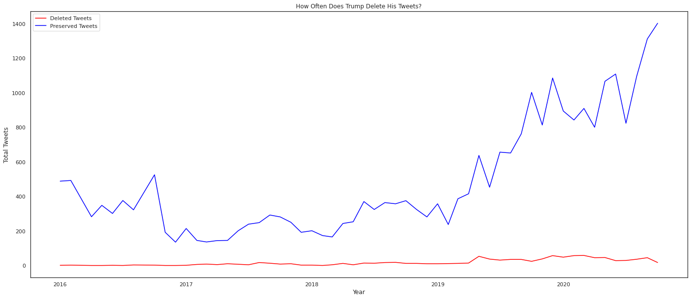
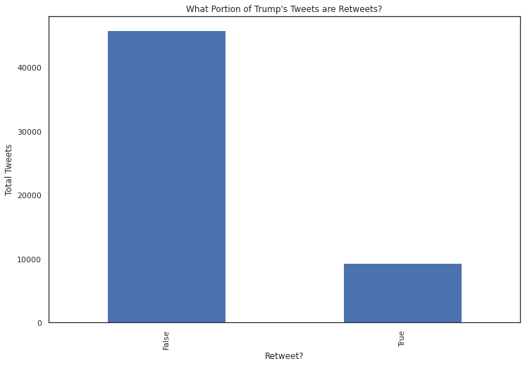
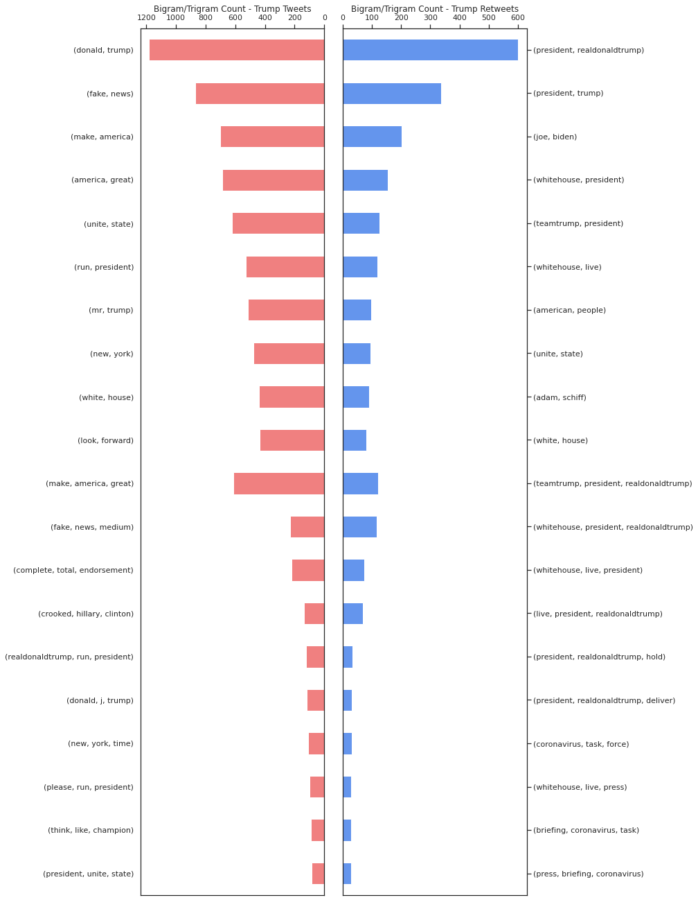
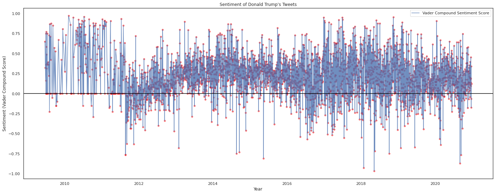
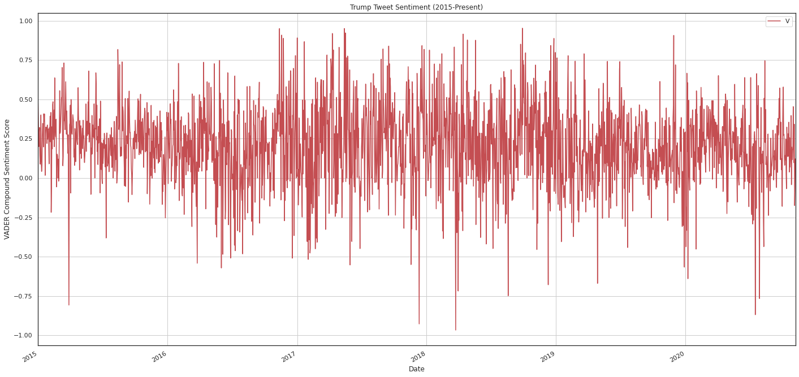

# Analyzing Trump's Tweets Using Natural Language Processing
In this project, I will be analyzing over 50,000 of Donald Trump's tweets using Python and Natural Language Processing (NLP) techniques. Thankfully, [The Trump Archive](https://www.thetrumparchive.com) has provided an open-source API dedicated entirely to Donald Trump's tweets, and we will be using this dataset to perform our analysis today. 

# Setup

## Imports


```python
# Working with dates
from datetime import datetime as dt
from pytz import timezone

# Data cleaning, analysis
import pandas as pd
import numpy as np

# Data Visualization
import matplotlib as mpl
from matplotlib import pyplot as plt 
import seaborn as sns
%matplotlib inline

# Natural Language Processing
import nltk, re, string
from nltk import word_tokenize
from nltk.stem import WordNetLemmatizer
from nltk.corpus import stopwords
from nltk.util import ngrams
from nltk.corpus import wordnet
from collections import Counter
nltk.download('stopwords')
nltk.download('punkt')
nltk.download('wordnet')


# VADER Sentiment Analyzer from NLTK
from nltk.sentiment import SentimentAnalyzer
from nltk.sentiment.util import *
from nltk.sentiment.vader import SentimentIntensityAnalyzer
nltk.download('vader_lexicon')

# Hide warnings
import warnings
warnings.filterwarnings('ignore')
```

    [nltk_data] Downloading package stopwords to
    [nltk_data]     C:\Users\Thet\AppData\Roaming\nltk_data...
    [nltk_data]   Package stopwords is already up-to-date!
    [nltk_data] Downloading package punkt to
    [nltk_data]     C:\Users\Thet\AppData\Roaming\nltk_data...
    [nltk_data]   Package punkt is already up-to-date!
    [nltk_data] Downloading package wordnet to
    [nltk_data]     C:\Users\Thet\AppData\Roaming\nltk_data...
    [nltk_data]   Package wordnet is already up-to-date!
    [nltk_data] Downloading package vader_lexicon to
    [nltk_data]     C:\Users\Thet\AppData\Roaming\nltk_data...
    

## Loading the Data


```python
url = "https://raw.githubusercontent.com/naingthet/twitter-nlp/main/trump_tweets.csv?token=ARUU4WFK6DI5K7PZBZ5F52K7WRGN6"
trump_tweets = pd.read_csv(url, parse_dates=True)
trump_tweets.head()
```


    ---------------------------------------------------------------------------

    HTTPError                                 Traceback (most recent call last)

    <ipython-input-2-7a51e6d08fac> in <module>
          1 url = "https://raw.githubusercontent.com/naingthet/twitter-nlp/main/trump_tweets.csv?token=ARUU4WFK6DI5K7PZBZ5F52K7WRGN6"
    ----> 2 trump_tweets = pd.read_csv(url, parse_dates=True)
          3 trump_tweets.head()
    

    ~\anaconda3\lib\site-packages\pandas\io\parsers.py in parser_f(filepath_or_buffer, sep, delimiter, header, names, index_col, usecols, squeeze, prefix, mangle_dupe_cols, dtype, engine, converters, true_values, false_values, skipinitialspace, skiprows, skipfooter, nrows, na_values, keep_default_na, na_filter, verbose, skip_blank_lines, parse_dates, infer_datetime_format, keep_date_col, date_parser, dayfirst, cache_dates, iterator, chunksize, compression, thousands, decimal, lineterminator, quotechar, quoting, doublequote, escapechar, comment, encoding, dialect, error_bad_lines, warn_bad_lines, delim_whitespace, low_memory, memory_map, float_precision)
        674         )
        675 
    --> 676         return _read(filepath_or_buffer, kwds)
        677 
        678     parser_f.__name__ = name
    

    ~\anaconda3\lib\site-packages\pandas\io\parsers.py in _read(filepath_or_buffer, kwds)
        428     # though mypy handling of conditional imports is difficult.
        429     # See https://github.com/python/mypy/issues/1297
    --> 430     fp_or_buf, _, compression, should_close = get_filepath_or_buffer(
        431         filepath_or_buffer, encoding, compression
        432     )
    

    ~\anaconda3\lib\site-packages\pandas\io\common.py in get_filepath_or_buffer(filepath_or_buffer, encoding, compression, mode)
        170 
        171     if isinstance(filepath_or_buffer, str) and is_url(filepath_or_buffer):
    --> 172         req = urlopen(filepath_or_buffer)
        173         content_encoding = req.headers.get("Content-Encoding", None)
        174         if content_encoding == "gzip":
    

    ~\anaconda3\lib\site-packages\pandas\io\common.py in urlopen(*args, **kwargs)
        139     import urllib.request
        140 
    --> 141     return urllib.request.urlopen(*args, **kwargs)
        142 
        143 
    

    ~\anaconda3\lib\urllib\request.py in urlopen(url, data, timeout, cafile, capath, cadefault, context)
        220     else:
        221         opener = _opener
    --> 222     return opener.open(url, data, timeout)
        223 
        224 def install_opener(opener):
    

    ~\anaconda3\lib\urllib\request.py in open(self, fullurl, data, timeout)
        529         for processor in self.process_response.get(protocol, []):
        530             meth = getattr(processor, meth_name)
    --> 531             response = meth(req, response)
        532 
        533         return response
    

    ~\anaconda3\lib\urllib\request.py in http_response(self, request, response)
        638         # request was successfully received, understood, and accepted.
        639         if not (200 <= code < 300):
    --> 640             response = self.parent.error(
        641                 'http', request, response, code, msg, hdrs)
        642 
    

    ~\anaconda3\lib\urllib\request.py in error(self, proto, *args)
        567         if http_err:
        568             args = (dict, 'default', 'http_error_default') + orig_args
    --> 569             return self._call_chain(*args)
        570 
        571 # XXX probably also want an abstract factory that knows when it makes
    

    ~\anaconda3\lib\urllib\request.py in _call_chain(self, chain, kind, meth_name, *args)
        500         for handler in handlers:
        501             func = getattr(handler, meth_name)
    --> 502             result = func(*args)
        503             if result is not None:
        504                 return result
    

    ~\anaconda3\lib\urllib\request.py in http_error_default(self, req, fp, code, msg, hdrs)
        647 class HTTPDefaultErrorHandler(BaseHandler):
        648     def http_error_default(self, req, fp, code, msg, hdrs):
    --> 649         raise HTTPError(req.full_url, code, msg, hdrs, fp)
        650 
        651 class HTTPRedirectHandler(BaseHandler):
    

    HTTPError: HTTP Error 404: Not Found


```python
len(trump_tweets)
```


    55090


```python
# Creating a deep copy of the dataset in case of contamination or mistakes
trump = trump_tweets.copy(deep=True)
trump.head()
```


<div>
<style scoped>
    .dataframe tbody tr th:only-of-type {
        vertical-align: middle;
    }

    .dataframe tbody tr th {
        vertical-align: top;
    }

    .dataframe thead th {
        text-align: right;
    }
</style>
<table border="1" class="dataframe">
  <thead>
    <tr style="text-align: right;">
      <th></th>
      <th>id</th>
      <th>text</th>
      <th>isRetweet</th>
      <th>isDeleted</th>
      <th>device</th>
      <th>favorites</th>
      <th>retweets</th>
      <th>date</th>
    </tr>
  </thead>
  <tbody>
    <tr>
      <th>0</th>
      <td>98454970654916608</td>
      <td>Republicans and Democrats have both created ou...</td>
      <td>f</td>
      <td>f</td>
      <td>TweetDeck</td>
      <td>49</td>
      <td>255</td>
      <td>2011-08-02 18:07:48</td>
    </tr>
    <tr>
      <th>1</th>
      <td>1234653427789070336</td>
      <td>I was thrilled to be back in the Great city of...</td>
      <td>f</td>
      <td>f</td>
      <td>Twitter for iPhone</td>
      <td>73748</td>
      <td>17404</td>
      <td>2020-03-03 01:34:50</td>
    </tr>
    <tr>
      <th>2</th>
      <td>1218010753434820614</td>
      <td>RT @CBS_Herridge: READ: Letter to surveillance...</td>
      <td>t</td>
      <td>f</td>
      <td>Twitter for iPhone</td>
      <td>0</td>
      <td>7396</td>
      <td>2020-01-17 03:22:47</td>
    </tr>
    <tr>
      <th>3</th>
      <td>1304875170860015617</td>
      <td>The Unsolicited Mail In Ballot Scam is a major...</td>
      <td>f</td>
      <td>f</td>
      <td>Twitter for iPhone</td>
      <td>80527</td>
      <td>23502</td>
      <td>2020-09-12 20:10:58</td>
    </tr>
    <tr>
      <th>4</th>
      <td>1218159531554897920</td>
      <td>RT @MZHemingway: Very friendly telling of even...</td>
      <td>t</td>
      <td>f</td>
      <td>Twitter for iPhone</td>
      <td>0</td>
      <td>9081</td>
      <td>2020-01-17 13:13:59</td>
    </tr>
  </tbody>
</table>
</div>


## Useful functions

### Time Series Graphing


```python
def date_plotter(df, x, y, figsize = (12,6), fmt = 'r-', increments = 'month'):
  # This function will help us to create appealing and effective graphs for our time-series data
  # Input a dataframe and specify x and y columns (x column should contain dates) 
  
  # Preparing the data

  # Save the df as a new variable
  data = df

  # Convert date values to datetime format
  data[x] = data[x].apply(pd.to_datetime)
  # Save the date values to a list
  dates_list = data[x].to_list()
  # Convert list of dates to numerical format; these will be the x values
  dates = mpl.dates.date2num(dates_list)

  # Gathering the y values
  y_list = data[y].to_list()
  y_values = np.array(y_list)

  # Plotting

  # Create figure, axes, and plot
  fig, ax = plt.subplots(figsize = figsize)
  ax.plot_date(x = dates, y = y_values, fmt = fmt)

  # Formatting dates
  years = mpl.dates.YearLocator()   # every year
  months = mpl.dates.MonthLocator()  # every month
  years_fmt = mpl.dates.DateFormatter('%Y')
  months_fmt = mpl.dates.DateFormatter('%Y-%m')

  # Formatting the ticks by months or years
  # Creating a list of options for increments to ensure proper input
  increment_options = ['month', 'year']
  if increments not in increment_options:
    raise ValueError("Invalid increment type. Expected one of: {}".format(increment_options))
  
  if increments == 'month':
    ax.xaxis.set_major_locator(months)
    ax.xaxis.set_major_formatter(months_fmt)
  elif increments == 'year':
    ax.xaxis.set_major_locator(years)
    ax.xaxis.set_major_formatter(years_fmt)

  # Setting x-axis limits  
  datemin = dates[0]
  datemax = dates[-1]
  ax.set_xlim(datemin, datemax)

  # Formatting coordinate grid
  if increments == 'month':
    ax.format_xdata = mpl.dates.DateFormatter('%Y-%m')
  elif increments == 'year':
    ax.format_xdata = mpl.dates.DateFormatter('%Y')
  
  ax.grid(True)

  # X-axis formatting
  fig.autofmt_xdate()

  plt.show()
```

# Data Cleaning

## Working with dates
First, we will convert the date information into datetime format to make analysis easier


```python
# Creating a function to change strings to datetime format
fmt = '%Y-%m-%d %H:%M:%S'
def create_dt(date):
    return dt.strptime(date, fmt)

# Creating a new column in the dataframe with datetime objects
trump['datetime'] = trump.date.apply(lambda x: create_dt(x))
```


    ---------------------------------------------------------------------------

    NameError                                 Traceback (most recent call last)

    <ipython-input-4-37668d3a2ddf> in <module>
          5 
          6 # Creating a new column in the dataframe with datetime objects
    ----> 7 trump['datetime'] = trump.date.apply(lambda x: create_dt(x))
    

    NameError: name 'trump' is not defined


```python
date_ex = trump.datetime[0]
print(date_ex)
```

    2011-08-02 18:07:48
    


```python
#Since all of the dates are in UTC time, we need to convert them to EST. The pytz module will help us do this
def to_est(date):
  date_utc = date.replace(tzinfo=timezone('UTC'))
  date_est = date_utc.astimezone(timezone('US/Eastern'))
  return date_est
```


```python
# Now we can apply the function we created to create a new column with the local/eastern time
trump['date_est'] = trump.datetime.apply(lambda x: to_est(x))
trump.head()
```


<div>
<style scoped>
    .dataframe tbody tr th:only-of-type {
        vertical-align: middle;
    }

    .dataframe tbody tr th {
        vertical-align: top;
    }

    .dataframe thead th {
        text-align: right;
    }
</style>
<table border="1" class="dataframe">
  <thead>
    <tr style="text-align: right;">
      <th></th>
      <th>id</th>
      <th>text</th>
      <th>isRetweet</th>
      <th>isDeleted</th>
      <th>device</th>
      <th>favorites</th>
      <th>retweets</th>
      <th>date</th>
      <th>datetime</th>
      <th>date_est</th>
    </tr>
  </thead>
  <tbody>
    <tr>
      <th>0</th>
      <td>98454970654916608</td>
      <td>Republicans and Democrats have both created ou...</td>
      <td>f</td>
      <td>f</td>
      <td>TweetDeck</td>
      <td>49</td>
      <td>255</td>
      <td>2011-08-02 18:07:48</td>
      <td>2011-08-02 18:07:48</td>
      <td>2011-08-02 14:07:48-04:00</td>
    </tr>
    <tr>
      <th>1</th>
      <td>1234653427789070336</td>
      <td>I was thrilled to be back in the Great city of...</td>
      <td>f</td>
      <td>f</td>
      <td>Twitter for iPhone</td>
      <td>73748</td>
      <td>17404</td>
      <td>2020-03-03 01:34:50</td>
      <td>2020-03-03 01:34:50</td>
      <td>2020-03-02 20:34:50-05:00</td>
    </tr>
    <tr>
      <th>2</th>
      <td>1218010753434820614</td>
      <td>RT @CBS_Herridge: READ: Letter to surveillance...</td>
      <td>t</td>
      <td>f</td>
      <td>Twitter for iPhone</td>
      <td>0</td>
      <td>7396</td>
      <td>2020-01-17 03:22:47</td>
      <td>2020-01-17 03:22:47</td>
      <td>2020-01-16 22:22:47-05:00</td>
    </tr>
    <tr>
      <th>3</th>
      <td>1304875170860015617</td>
      <td>The Unsolicited Mail In Ballot Scam is a major...</td>
      <td>f</td>
      <td>f</td>
      <td>Twitter for iPhone</td>
      <td>80527</td>
      <td>23502</td>
      <td>2020-09-12 20:10:58</td>
      <td>2020-09-12 20:10:58</td>
      <td>2020-09-12 16:10:58-04:00</td>
    </tr>
    <tr>
      <th>4</th>
      <td>1218159531554897920</td>
      <td>RT @MZHemingway: Very friendly telling of even...</td>
      <td>t</td>
      <td>f</td>
      <td>Twitter for iPhone</td>
      <td>0</td>
      <td>9081</td>
      <td>2020-01-17 13:13:59</td>
      <td>2020-01-17 13:13:59</td>
      <td>2020-01-17 08:13:59-05:00</td>
    </tr>
  </tbody>
</table>
</div>


```python
# Dropping the UTC columns and renaming the date_est column as 'date'
trump = trump.drop(['date', 'datetime'], axis = 1)
trump = trump.rename(columns = {'date_est':'date'})
trump.head()
```


<div>
<style scoped>
    .dataframe tbody tr th:only-of-type {
        vertical-align: middle;
    }

    .dataframe tbody tr th {
        vertical-align: top;
    }

    .dataframe thead th {
        text-align: right;
    }
</style>
<table border="1" class="dataframe">
  <thead>
    <tr style="text-align: right;">
      <th></th>
      <th>id</th>
      <th>text</th>
      <th>isRetweet</th>
      <th>isDeleted</th>
      <th>device</th>
      <th>favorites</th>
      <th>retweets</th>
      <th>date</th>
    </tr>
  </thead>
  <tbody>
    <tr>
      <th>0</th>
      <td>98454970654916608</td>
      <td>Republicans and Democrats have both created ou...</td>
      <td>f</td>
      <td>f</td>
      <td>TweetDeck</td>
      <td>49</td>
      <td>255</td>
      <td>2011-08-02 14:07:48-04:00</td>
    </tr>
    <tr>
      <th>1</th>
      <td>1234653427789070336</td>
      <td>I was thrilled to be back in the Great city of...</td>
      <td>f</td>
      <td>f</td>
      <td>Twitter for iPhone</td>
      <td>73748</td>
      <td>17404</td>
      <td>2020-03-02 20:34:50-05:00</td>
    </tr>
    <tr>
      <th>2</th>
      <td>1218010753434820614</td>
      <td>RT @CBS_Herridge: READ: Letter to surveillance...</td>
      <td>t</td>
      <td>f</td>
      <td>Twitter for iPhone</td>
      <td>0</td>
      <td>7396</td>
      <td>2020-01-16 22:22:47-05:00</td>
    </tr>
    <tr>
      <th>3</th>
      <td>1304875170860015617</td>
      <td>The Unsolicited Mail In Ballot Scam is a major...</td>
      <td>f</td>
      <td>f</td>
      <td>Twitter for iPhone</td>
      <td>80527</td>
      <td>23502</td>
      <td>2020-09-12 16:10:58-04:00</td>
    </tr>
    <tr>
      <th>4</th>
      <td>1218159531554897920</td>
      <td>RT @MZHemingway: Very friendly telling of even...</td>
      <td>t</td>
      <td>f</td>
      <td>Twitter for iPhone</td>
      <td>0</td>
      <td>9081</td>
      <td>2020-01-17 08:13:59-05:00</td>
    </tr>
  </tbody>
</table>
</div>


```python
# Creating additional columns with date information
trump['date_dmy'] = trump['date'].apply(lambda x: x.strftime("%Y-%m-%d")) 
trump['date_my'] = trump['date'].apply(lambda x: x.strftime("%Y-%m")) 
trump['time'] = trump['date'].apply(lambda x: x.strftime("%H:%M"))
trump['hour'] = trump['date'].apply(lambda x: x.strftime("%H"))
trump['day_of_week'] = trump['date'].apply(lambda x: x.strftime("%A"))
trump['year'] = trump['date'].apply(lambda x: x.strftime("%Y"))
trump['month'] = trump['date'].apply(lambda x: x.strftime("%m"))
trump.head()
```


<div>
<style scoped>
    .dataframe tbody tr th:only-of-type {
        vertical-align: middle;
    }

    .dataframe tbody tr th {
        vertical-align: top;
    }

    .dataframe thead th {
        text-align: right;
    }
</style>
<table border="1" class="dataframe">
  <thead>
    <tr style="text-align: right;">
      <th></th>
      <th>id</th>
      <th>text</th>
      <th>isRetweet</th>
      <th>isDeleted</th>
      <th>device</th>
      <th>favorites</th>
      <th>retweets</th>
      <th>date</th>
      <th>date_dmy</th>
      <th>date_my</th>
      <th>time</th>
      <th>hour</th>
      <th>day_of_week</th>
      <th>year</th>
      <th>month</th>
    </tr>
  </thead>
  <tbody>
    <tr>
      <th>0</th>
      <td>98454970654916608</td>
      <td>Republicans and Democrats have both created ou...</td>
      <td>f</td>
      <td>f</td>
      <td>TweetDeck</td>
      <td>49</td>
      <td>255</td>
      <td>2011-08-02 14:07:48-04:00</td>
      <td>2011-08-02</td>
      <td>2011-08</td>
      <td>14:07</td>
      <td>14</td>
      <td>Tuesday</td>
      <td>2011</td>
      <td>08</td>
    </tr>
    <tr>
      <th>1</th>
      <td>1234653427789070336</td>
      <td>I was thrilled to be back in the Great city of...</td>
      <td>f</td>
      <td>f</td>
      <td>Twitter for iPhone</td>
      <td>73748</td>
      <td>17404</td>
      <td>2020-03-02 20:34:50-05:00</td>
      <td>2020-03-02</td>
      <td>2020-03</td>
      <td>20:34</td>
      <td>20</td>
      <td>Monday</td>
      <td>2020</td>
      <td>03</td>
    </tr>
    <tr>
      <th>2</th>
      <td>1218010753434820614</td>
      <td>RT @CBS_Herridge: READ: Letter to surveillance...</td>
      <td>t</td>
      <td>f</td>
      <td>Twitter for iPhone</td>
      <td>0</td>
      <td>7396</td>
      <td>2020-01-16 22:22:47-05:00</td>
      <td>2020-01-16</td>
      <td>2020-01</td>
      <td>22:22</td>
      <td>22</td>
      <td>Thursday</td>
      <td>2020</td>
      <td>01</td>
    </tr>
    <tr>
      <th>3</th>
      <td>1304875170860015617</td>
      <td>The Unsolicited Mail In Ballot Scam is a major...</td>
      <td>f</td>
      <td>f</td>
      <td>Twitter for iPhone</td>
      <td>80527</td>
      <td>23502</td>
      <td>2020-09-12 16:10:58-04:00</td>
      <td>2020-09-12</td>
      <td>2020-09</td>
      <td>16:10</td>
      <td>16</td>
      <td>Saturday</td>
      <td>2020</td>
      <td>09</td>
    </tr>
    <tr>
      <th>4</th>
      <td>1218159531554897920</td>
      <td>RT @MZHemingway: Very friendly telling of even...</td>
      <td>t</td>
      <td>f</td>
      <td>Twitter for iPhone</td>
      <td>0</td>
      <td>9081</td>
      <td>2020-01-17 08:13:59-05:00</td>
      <td>2020-01-17</td>
      <td>2020-01</td>
      <td>08:13</td>
      <td>08</td>
      <td>Friday</td>
      <td>2020</td>
      <td>01</td>
    </tr>
  </tbody>
</table>
</div>


# Exploratory Data Analysis/Visualization
Next, we will go through each of the non-tweet variables in the dataset and explore them.


```python
# Seaborn setup
sns.set_theme(style='white')
```

To start, let's look at the distribution of Trump's tweets over time. 

## Tweets per Month


```python
tweets_my = trump.date_my.groupby(trump.date_my).count()
fig, ax = plt.subplots()
tweets_my.plot(kind = 'line', figsize = (24,10))
ax.set_title("Donald Trump's Tweets Per Month")
ax.set_xlabel('Date (Year-Month)')
ax.set_ylabel('Tweets per Month')
plt.show()
```





## Tweets per Day


```python
tweets_day = trump.date_dmy.groupby(trump.date_dmy).count()
fig, ax = plt.subplots(figsize = (24,10))
tweets_day.plot(kind = 'line', linewidth = 1)
ax.set_title('Donald Trump Tweets per Day')
ax.set_ylabel('Tweets per Day')
ax.set_xlabel('Date (Year-Month-Day)')
plt.show()
```





**I know what you're thinking at this point: that must be an error! 200 tweets in one day? Let's take a look at this day in particular and see what we find.** 


```python
trump.date_dmy.value_counts()
```


    2020-06-05    200
    2015-01-04    147
    2020-01-22    142
    2015-01-05    133
    2020-05-10    126
                 ... 
    2011-02-23      1
    2016-12-18      1
    2010-02-10      1
    2009-08-11      1
    2011-06-02      1
    Name: date_dmy, Length: 3444, dtype: int64


Turns out, on June 5th, 2005, Donald Trump did indeed tweet 200 times! Check out this article from [Insider](https://www.insider.com/trump-breaks-record-most-tweets-in-a-single-day-2020-6).

## Tweets by Day of the Week


```python
tweets_by_day = trump.day_of_week.groupby(trump.day_of_week).count()
tweets_by_day = tweets_by_day.reindex(['Monday', 'Tuesday', 'Wednesday', 'Thursday', 'Friday', 'Saturday', 'Sunday'])
fig, ax = plt.subplots(figsize = (12, 8))
tweets_by_day.plot(kind = 'bar')
ax.set_title("Donald Trump's Tweets by Day of the Week")
ax.set_ylabel('Total Tweets')
ax.set_xlabel('Day of the Week')
plt.show()
```





## Deleted Tweets
How often does Donald delete his tweets? 


```python
trump.head()
```


<div>
<style scoped>
    .dataframe tbody tr th:only-of-type {
        vertical-align: middle;
    }

    .dataframe tbody tr th {
        vertical-align: top;
    }

    .dataframe thead th {
        text-align: right;
    }
</style>
<table border="1" class="dataframe">
  <thead>
    <tr style="text-align: right;">
      <th></th>
      <th>id</th>
      <th>text</th>
      <th>isRetweet</th>
      <th>isDeleted</th>
      <th>device</th>
      <th>favorites</th>
      <th>retweets</th>
      <th>date</th>
      <th>date_dmy</th>
      <th>date_my</th>
      <th>time</th>
      <th>hour</th>
      <th>day_of_week</th>
      <th>year</th>
      <th>month</th>
    </tr>
  </thead>
  <tbody>
    <tr>
      <th>0</th>
      <td>98454970654916608</td>
      <td>Republicans and Democrats have both created ou...</td>
      <td>f</td>
      <td>f</td>
      <td>TweetDeck</td>
      <td>49</td>
      <td>255</td>
      <td>2011-08-02 14:07:48-04:00</td>
      <td>2011-08-02</td>
      <td>2011-08</td>
      <td>14:07</td>
      <td>14</td>
      <td>Tuesday</td>
      <td>2011</td>
      <td>08</td>
    </tr>
    <tr>
      <th>1</th>
      <td>1234653427789070336</td>
      <td>I was thrilled to be back in the Great city of...</td>
      <td>f</td>
      <td>f</td>
      <td>Twitter for iPhone</td>
      <td>73748</td>
      <td>17404</td>
      <td>2020-03-02 20:34:50-05:00</td>
      <td>2020-03-02</td>
      <td>2020-03</td>
      <td>20:34</td>
      <td>20</td>
      <td>Monday</td>
      <td>2020</td>
      <td>03</td>
    </tr>
    <tr>
      <th>2</th>
      <td>1218010753434820614</td>
      <td>RT @CBS_Herridge: READ: Letter to surveillance...</td>
      <td>t</td>
      <td>f</td>
      <td>Twitter for iPhone</td>
      <td>0</td>
      <td>7396</td>
      <td>2020-01-16 22:22:47-05:00</td>
      <td>2020-01-16</td>
      <td>2020-01</td>
      <td>22:22</td>
      <td>22</td>
      <td>Thursday</td>
      <td>2020</td>
      <td>01</td>
    </tr>
    <tr>
      <th>3</th>
      <td>1304875170860015617</td>
      <td>The Unsolicited Mail In Ballot Scam is a major...</td>
      <td>f</td>
      <td>f</td>
      <td>Twitter for iPhone</td>
      <td>80527</td>
      <td>23502</td>
      <td>2020-09-12 16:10:58-04:00</td>
      <td>2020-09-12</td>
      <td>2020-09</td>
      <td>16:10</td>
      <td>16</td>
      <td>Saturday</td>
      <td>2020</td>
      <td>09</td>
    </tr>
    <tr>
      <th>4</th>
      <td>1218159531554897920</td>
      <td>RT @MZHemingway: Very friendly telling of even...</td>
      <td>t</td>
      <td>f</td>
      <td>Twitter for iPhone</td>
      <td>0</td>
      <td>9081</td>
      <td>2020-01-17 08:13:59-05:00</td>
      <td>2020-01-17</td>
      <td>2020-01</td>
      <td>08:13</td>
      <td>08</td>
      <td>Friday</td>
      <td>2020</td>
      <td>01</td>
    </tr>
  </tbody>
</table>
</div>


```python
deleted_tweets = trump.isDeleted.groupby(trump.isDeleted).count()
fig, ax = plt.subplots()
deleted_tweets.plot(kind = 'bar', figsize = (12,8))
ax.set_xticklabels(['False', 'True'])
ax.set_xlabel('Deleted Tweet?')
ax.set_ylabel('Total Tweets')
ax.set_title('How Often Does Trump Delete His Tweets?')
plt.show()
```





## Deleted Tweets over Time


```python
deleted_my = trump[trump.isDeleted == 't'].groupby(trump.date_my).id.count().reset_index()
deleted_my = deleted_my.rename(columns={'id':'num_deleted'})
```


```python
not_deleted_my = trump[trump.isDeleted == 'f'].groupby(trump.date_my).id.count().reset_index()
not_deleted_my = not_deleted_my.rename(columns={'id':'num_not_deleted'})
```


```python
deleted_or_not = pd.merge(deleted_my, not_deleted_my)
deleted_or_not.date_my = deleted_or_not.date_my.apply(lambda x: dt.strptime(x, '%Y-%m'))
```


```python
fig, ax = plt.subplots(figsize = (24,10))
plt.plot(deleted_or_not.date_my, deleted_or_not.num_deleted, c='red')
plt.plot(deleted_or_not.date_my, deleted_or_not.num_not_deleted, c='blue')
ax.set_title('How Often Does Trump Delete His Tweets?')
ax.set_ylabel('Total Tweets')
ax.set_xlabel('Year')
plt.legend(labels= ['Deleted Tweets', 'Preserved Tweets'])
plt.show()
```





## Retweets


```python
retweets = trump.isRetweet.groupby(trump.isRetweet).count()
fig, ax = plt.subplots(figsize = (12,8))
retweets.plot(kind = 'bar')
ax.set_ylabel('Total Tweets')
ax.set_title("What Portion of Trump's Tweets are Retweets?")
ax.set_xticklabels(['False', 'True'])
ax.set_xlabel('Retweet?')
plt.show()
```





It appears that the majority of Trump's tweets are retweets. This is something we should keep in mind as we move forward into text analysis.

# Applying NLP to Analyze Trump's Tweets


**We will now perform a sentiment analysis using VADER**

Before we begin our analysis, I will separate the tweets into two datasets: original tweets and retweets. 


```python
# Split tweets into original tweets and retweets
original_tweets = trump[trump.isRetweet == 'f']
trump_retweets = trump[trump.isRetweet == 't']
print(original_tweets.shape) # We still have over 45,000 original tweets to analyze!
original_tweets.head()
```

    (45755, 15)
    


<div>
<style scoped>
    .dataframe tbody tr th:only-of-type {
        vertical-align: middle;
    }

    .dataframe tbody tr th {
        vertical-align: top;
    }

    .dataframe thead th {
        text-align: right;
    }
</style>
<table border="1" class="dataframe">
  <thead>
    <tr style="text-align: right;">
      <th></th>
      <th>id</th>
      <th>text</th>
      <th>isRetweet</th>
      <th>isDeleted</th>
      <th>device</th>
      <th>favorites</th>
      <th>retweets</th>
      <th>date</th>
      <th>date_dmy</th>
      <th>date_my</th>
      <th>time</th>
      <th>hour</th>
      <th>day_of_week</th>
      <th>year</th>
      <th>month</th>
    </tr>
  </thead>
  <tbody>
    <tr>
      <th>0</th>
      <td>98454970654916608</td>
      <td>Republicans and Democrats have both created ou...</td>
      <td>f</td>
      <td>f</td>
      <td>TweetDeck</td>
      <td>49</td>
      <td>255</td>
      <td>2011-08-02 14:07:48-04:00</td>
      <td>2011-08-02</td>
      <td>2011-08</td>
      <td>14:07</td>
      <td>14</td>
      <td>Tuesday</td>
      <td>2011</td>
      <td>08</td>
    </tr>
    <tr>
      <th>1</th>
      <td>1234653427789070336</td>
      <td>I was thrilled to be back in the Great city of...</td>
      <td>f</td>
      <td>f</td>
      <td>Twitter for iPhone</td>
      <td>73748</td>
      <td>17404</td>
      <td>2020-03-02 20:34:50-05:00</td>
      <td>2020-03-02</td>
      <td>2020-03</td>
      <td>20:34</td>
      <td>20</td>
      <td>Monday</td>
      <td>2020</td>
      <td>03</td>
    </tr>
    <tr>
      <th>3</th>
      <td>1304875170860015617</td>
      <td>The Unsolicited Mail In Ballot Scam is a major...</td>
      <td>f</td>
      <td>f</td>
      <td>Twitter for iPhone</td>
      <td>80527</td>
      <td>23502</td>
      <td>2020-09-12 16:10:58-04:00</td>
      <td>2020-09-12</td>
      <td>2020-09</td>
      <td>16:10</td>
      <td>16</td>
      <td>Saturday</td>
      <td>2020</td>
      <td>09</td>
    </tr>
    <tr>
      <th>6</th>
      <td>1315779944002199552</td>
      <td>“I’m running as a proud Democrat, for the Sena...</td>
      <td>f</td>
      <td>f</td>
      <td>Twitter for iPhone</td>
      <td>149007</td>
      <td>34897</td>
      <td>2020-10-12 18:22:39-04:00</td>
      <td>2020-10-12</td>
      <td>2020-10</td>
      <td>18:22</td>
      <td>18</td>
      <td>Monday</td>
      <td>2020</td>
      <td>10</td>
    </tr>
    <tr>
      <th>7</th>
      <td>1223640662689689602</td>
      <td>Getting a little exercise this morning! https:...</td>
      <td>f</td>
      <td>f</td>
      <td>Twitter for iPhone</td>
      <td>285863</td>
      <td>30209</td>
      <td>2020-02-01 11:14:02-05:00</td>
      <td>2020-02-01</td>
      <td>2020-02</td>
      <td>11:14</td>
      <td>11</td>
      <td>Saturday</td>
      <td>2020</td>
      <td>02</td>
    </tr>
  </tbody>
</table>
</div>


```python
# Creating variables containing only the tweets
dt_text = original_tweets.text
rt_text = trump_retweets.text
```

## Cleaning the text data

### Noise Removal and Tokenization

First, we will clean the text by removing punctuation and other noisy characters. We will also tokenize the strings into individual words


```python
# Creating a function that we can apply to each row of text
def text_cleaner(text):
  # Use regular expressions to remove punctutation, nonstandard characters, and web links
  text = re.sub(r'[\.\?\!\,\:\;\"\)\(]|https.+|[^(a-zA-Z)\s]', '', text)
  text = text.lower()

  # Tokenize the string into words
  words = word_tokenize(text)
  return words
```


```python
dt_tokens = dt_text.apply(text_cleaner)
rt_tokens = rt_text.apply(text_cleaner)
```


```python
dt_tokens
```


    0        [republicans, and, democrats, have, both, crea...
    1        [i, was, thrilled, to, be, back, in, the, grea...
    3        [the, unsolicited, mail, in, ballot, scam, is,...
    6        [im, running, as, a, proud, democrat, for, the...
    7            [getting, a, little, exercise, this, morning]
                                   ...                        
    55074    [iran, never, won, a, war, but, never, lost, a...
    55078    [thank, you, to, the, dcexaminer, washington, ...
    55079    [one, of, my, greatest, honors, was, to, have,...
    55088    [just, signed, an, order, to, support, the, wo...
    55089    [suburban, women, want, safety, amp, security,...
    Name: text, Length: 45755, dtype: object


```python
# The first token of every tweet is 'rt'. Let's remove this
rt_tokens 
```


    2        [rt, cbsherridge, read, letter, to, surveillan...
    4        [rt, mzhemingway, very, friendly, telling, of,...
    5        [rt, whitehouse, president, realdonaldtrump, a...
    12                                         [rt, erictrump]
    13       [rt, gopchairwoman, the, economic, boom, conti...
                                   ...                        
    55083    [rt, heatherjones, dear, stupid, people, peace...
    55084    [rt, heatherjones, we, have, taken, appropriat...
    55085    [rt, randpaul, i, dont, know, why, joebiden, t...
    55086    [rt, elisestefanik, president, realdonaldtrump...
    55087    [rt, teamtrump, live, presidential, debate, de...
    Name: text, Length: 9335, dtype: object


```python
# Removing the 'rt' tokens
def rt_cleaner(lst):
  lst = lst[1:]
  return lst
rt_tokens = rt_tokens.apply(rt_cleaner)
rt_tokens
```


    2        [cbsherridge, read, letter, to, surveillance, ...
    4        [mzhemingway, very, friendly, telling, of, eve...
    5        [whitehouse, president, realdonaldtrump, annou...
    12                                             [erictrump]
    13       [gopchairwoman, the, economic, boom, continues...
                                   ...                        
    55083    [heatherjones, dear, stupid, people, peace, is...
    55084    [heatherjones, we, have, taken, appropriate, f...
    55085    [randpaul, i, dont, know, why, joebiden, think...
    55086    [elisestefanik, president, realdonaldtrump, ex...
    55087    [teamtrump, live, presidential, debate, debate...
    Name: text, Length: 9335, dtype: object


### Further Text Normalization: Lemmatization and Stopword Removal

Next, we will lemmatize the words, effectively bringing them down to their root forms. We will do this instead of stemming, as stemming only removes affixes. To maximize the effectiveness of our lemmatization, we will also tag words with their part of speech (PoS).

At this step, we will further clean and normalize the text data by removing stopwords, which are words that do not provide meaningful information about the statements (in this case, our tweets).


```python
# Creating a function to pull the PoS for a particular word
def get_pos(word):
  # synsets will return synonyms for the input word, and each synonym will include a part of speech
  pos = wordnet.synsets(word)
  
  # We will now create a Counter() object, in which we will count the PoS tags for each of the synonyms in pos
  pos_counts = Counter()

  # Next, we will pull the PoS of each synonym using the .pos() method
  pos_counts["n"] = len(  [ item for item in pos if item.pos()=="n"]  )
  pos_counts["v"] = len(  [ item for item in pos if item.pos()=="v"]  )
  pos_counts["a"] = len(  [ item for item in pos if item.pos()=="a"]  )
  pos_counts["r"] = len(  [ item for item in pos if item.pos()=="r"]  )
  
  # The most likely PoS is that which has the highest count in pos_counts
  most_likely = pos_counts.most_common(1)[0][0]
  return most_likely
```

Now that we have created a function that will determine the most likely part of speech for any given word, we can use the output of this function to tag words during lemmatization.


```python
def text_cleaner_2(words):
  stop_words = stopwords.words('english')
  # Lemmatization with PoS tagging
  lemmatizer = WordNetLemmatizer()
  words = [lemmatizer.lemmatize(word, get_pos(word)) for word in words if word not in stop_words]
  # Stopword removal
  words = [word for word in words if word not in stop_words]
  return words
```


```python
dt_tokens_norm = dt_tokens.apply(text_cleaner_2)
rt_tokens_norm = rt_tokens.apply(text_cleaner_2)
```


```python
dt_tokens_norm.head()
```


    0    [republican, democrat, create, economic, problem]
    1    [thrill, back, great, city, charlotte, north, ...
    3    [unsolicited, mail, ballot, scam, major, threa...
    6    [im, run, proud, democrat, senate, sleepy, joe...
    7                     [get, little, exercise, morning]
    Name: text, dtype: object


```python
rt_tokens_norm.head()
```


    2     [cbsherridge, read, letter, surveillance, cour...
    4     [mzhemingway, friendly, tell, event, comeys, a...
    5     [whitehouse, president, realdonaldtrump, annou...
    12                                          [erictrump]
    13    [gopchairwoman, economic, boom, continue, k, j...
    Name: text, dtype: object


We have now finished cleaning our text. Let us now compare a tweet before and after our cleaning.


```python
dt_text[1]
```


    'I was thrilled to be back in the Great city of Charlotte, North Carolina with thousands of hardworking American Patriots who love our Country, cherish our values, respect our laws, and always put AMERICA FIRST! Thank you for a wonderful evening!! #KAG2020 https://t.co/dNJZfRsl9y'


```python
dt_tokens_norm[1]
```


    ['thrill',
     'back',
     'great',
     'city',
     'charlotte',
     'north',
     'carolina',
     'thousand',
     'hardworking',
     'american',
     'patriot',
     'love',
     'country',
     'cherish',
     'value',
     'respect',
     'law',
     'always',
     'put',
     'america',
     'first',
     'thank',
     'wonderful',
     'evening',
     'kag']


As you can see, the text looks very different from its initial state but still manages to convey the meaning of the original tweet.

## N-grams
Before we move on to sentiment analysis, let's take a quick look at the most common N-grams in each of our datasets. N-grams are sequences of N-terms found in the text data, and in this case we will be focusing on bigrams (2-grams) and trigrams (3-grams), as these are able to convey some information about the dataset without being too specific.


```python
# Unpacking the list of words
dt_words = [item for sublist in dt_tokens_norm.to_list() for item in sublist]
rt_words = [item for sublist in rt_tokens_norm.to_list() for item in sublist]
dt_words
```


    ['republican',
     'democrat',
     'create',
     'economic',
     'problem',
     'thrill',
     'back',
     'great',
     'city',
     'charlotte',
     'north',
     'carolina',
     'thousand',
     'hardworking',
     'american',
     'patriot',
     'love',
     'country',
     'cherish',
     'value',
     'respect',
     'law',
     'always',
     'put',
     'america',
     'first',
     'thank',
     'wonderful',
     'evening',
     'kag',
     'unsolicited',
     'mail',
     'ballot',
     'scam',
     'major',
     'threat',
     'democracy',
     'amp',
     'democrat',
     'know',
     'almost',
     'recent',
     'election',
     'use',
     'system',
     'even',
     'though',
     'much',
     'small',
     'amp',
     'far',
     'ballot',
     'count',
     'end',
     'disaster',
     'large',
     'number',
     'miss',
     'ballot',
     'amp',
     'fraud',
     'im',
     'run',
     'proud',
     'democrat',
     'senate',
     'sleepy',
     'joe',
     'biden',
     'today',
     'go',
     'get',
     'bad',
     'sustainable',
     'county',
     'china',
     'u',
     'get',
     'little',
     'exercise',
     'morning',
     'thank',
     'elise',
     'per',
     'request',
     'joe',
     'huge',
     'win',
     'today',
     'unite',
     'state',
     'peace',
     'world',
     'sudan',
     'agree',
     'peace',
     'normalization',
     'agreement',
     'israel',
     'unite',
     'arab',
     'emirate',
     'bahrain',
     'thats',
     'three',
     'arab',
     'country',
     'matter',
     'week',
     'follow',
     'thank',
     'megyn',
     'day',
     'maga',
     'nobody',
     'show',
     'obamas',
     'hate',
     'lace',
     'speech',
     'people',
     'energy',
     'still',
     'well',
     'joe',
     'land',
     'ohio',
     'see',
     'little',
     'thank',
     'ohio',
     'vote',
     'great',
     'ohio',
     'leave',
     'wisconsin',
     'see',
     'little',
     'thank',
     'ohio',
     'vote',
     'terrible',
     'thing',
     'biden',
     'say',
     'rig',
     'election',
     'land',
     'wisconsin',
     'big',
     'crowd',
     'way',
     'great',
     'show',
     'jessebwatters',
     'tonight',
     'watch',
     'way',
     'ohio',
     'wisconsin',
     'law',
     'enforcement',
     'watch',
     'involve',
     'dishonest',
     'thank',
     'wisconsin',
     'important',
     'election',
     'history',
     'country',
     'vote',
     'continue',
     'bring',
     'back',
     'job',
     'lower',
     'drug',
     'price',
     'support',
     'police',
     'protect',
     'defend',
     'border',
     'ensure',
     'product',
     'proudly',
     'stamp',
     'phrase',
     'make',
     'usa',
     'long',
     'president',
     'always',
     'stand',
     'hero',
     'law',
     'enforcement',
     'joe',
     'biden',
     'wont',
     'wisconsin',
     'vote',
     'maga',
     'true',
     'thank',
     'pensacola',
     'florida',
     'together',
     'go',
     'make',
     'america',
     'great',
     'debate',
     'poll',
     'average',
     'trump',
     'sleepy',
     'joe',
     'biden',
     'economy',
     'great',
     'ready',
     'set',
     'new',
     'record',
     'best',
     'ever',
     'biden',
     'destroy',
     'everything',
     'massive',
     'tax',
     'increase',
     'dont',
     'let',
     'happen',
     'fake',
     'news',
     'talk',
     'case',
     'case',
     'case',
     'include',
     'many',
     'low',
     'risk',
     'people',
     'medium',
     'everything',
     'possible',
     'create',
     'fear',
     'prior',
     'november',
     'rd',
     'case',
     'test',
     'way',
     'far',
     'best',
     'world',
     'mortality',
     'rate',
     'plus',
     'voteearlyday',
     'maga',
     'sound',
     'like',
     'typical',
     'washington',
     'politician',
     'im',
     'politician',
     'always',
     'play',
     'rule',
     'washington',
     'establishment',
     'elect',
     'fight',
     'hard',
     'anyone',
     'ever',
     'could',
     'sit',
     'watch',
     'take',
     'advantage',
     'anymore',
     'come',
     'stand',
     'way',
     'stand',
     'guard',
     'country',
     'love',
     'year',
     'watch',
     'one',
     'betrayal',
     'another',
     'politician',
     'like',
     'joe',
     'biden',
     'sell',
     'american',
     'worker',
     'every',
     'turnshattering',
     'life',
     'million',
     'american',
     'family',
     'family',
     'rake',
     'million',
     'dollar',
     'joe',
     'biden',
     'corrupt',
     'politician',
     'compromise',
     'china',
     'desperate',
     'biden',
     'win',
     'biden',
     'win',
     'china',
     'win',
     'china',
     'america',
     'corruption',
     'exactly',
     'decide',
     'run',
     'president',
     'first',
     'place',
     'thank',
     'great',
     'american',
     'patriot',
     'village',
     'florida',
     'maga',
     'th',
     'anniversary',
     'horrendous',
     'attack',
     'unite',
     'state',
     'marine',
     'sailor',
     'soldier',
     'beirut',
     'honor',
     'hero',
     'lose',
     'life',
     'day',
     'never',
     'forget',
     'semper',
     'fi',
     'joe',
     'bidens',
     'response',
     'hn',
     'swine',
     'flu',
     'far',
     'less',
     'lethal',
     'covid',
     'one',
     'weak',
     'worst',
     'history',
     'fight',
     'epidemic',
     'pandemic',
     'pathetic',
     'involve',
     'say',
     'joe',
     'didnt',
     'clue',
     'seanparnellusa',
     'bright',
     'star',
     'pennsylvania',
     'military',
     'vet',
     'low',
     'tax',
     'nd',
     'amendment',
     'totally',
     'protect',
     'opponent',
     'weak',
     'ineffective',
     'puppet',
     'pelosi',
     'new',
     'radical',
     'leave',
     'friend',
     'vote',
     'sean',
     'parnell',
     'important',
     'vote',
     'republican',
     'house',
     'break',
     'away',
     'pelosi',
     'high',
     'tax',
     'new',
     'radical',
     'leave',
     'friend',
     'protect',
     'nd',
     'amendment',
     'military',
     'vet',
     'sooo',
     'much',
     'pennsylvania',
     'ballot',
     'mistake',
     'make',
     'opinion',
     'purpose',
     'democrat',
     'governor',
     'put',
     'republican',
     'particular',
     'seanparnellusa',
     'great',
     'risk',
     'corrupt',
     'politics',
     'pennsylvania',
     'must',
     'investigate',
     'immediately',
     'way',
     'philadelphia',
     'control',
     'thejusticedept',
     'great',
     'magagras',
     'rally',
     'today',
     'wonderful',
     'long',
     'island',
     'cut',
     'tax',
     'stop',
     'crime',
     'vote',
     'trump',
     'city',
     'state',
     'mess',
     'lose',
     'thank',
     'congratulation',
     'senronjohnson',
     'dog',
     'pursuit',
     'chairman',
     'homeland',
     'political',
     'corruption',
     'thank',
     'new',
     'hampshire',
     'amaze',
     'carney',
     'joe',
     'bidens',
     'energy',
     'plan',
     'would',
     'eviscerate',
     'wisconsin',
     'sand',
     'miner',
     'thank',
     'maine',
     'maga',
     'thank',
     'rabbi',
     'congratulation',
     'armenian',
     'prime',
     'minister',
     'nikol',
     'pashinyan',
     'azerbaijani',
     'president',
     'ilham',
     'aliyev',
     'agree',
     'adhere',
     'cease',
     'fire',
     'effective',
     'midnight',
     'many',
     'life',
     'save',
     'proud',
     'team',
     'secpompeo',
     'amp',
     'steve',
     'biegun',
     'amp',
     'whnsc',
     'get',
     'deal',
     'great',
     'people',
     'vote',
     'trump',
     'biden',
     'dump',
     'new',
     'hampshire',
     'dem',
     'primary',
     'leave',
     'early',
     'first',
     'big',
     'victory',
     'honor',
     'maine',
     'suburban',
     'woman',
     'strong',
     'president',
     'trump',
     'watch',
     'minute',
     'clip',
     'texas',
     'pennsylvania',
     'ohio',
     'others',
     'please',
     'watch',
     'party',
     'joe',
     'stop',
     'fracking',
     'immediately',
     'million',
     'job',
     'lose',
     'energy',
     'price',
     'soar',
     'vote',
     'trump',
     'biden',
     'make',
     'another',
     'big',
     'mistake',
     'totally',
     'mix',
     'two',
     'crime',
     'bill',
     'didnt',
     'clue',
     'usual',
     'also',
     'freely',
     'use',
     'term',
     'super',
     'predator',
     'nasty',
     'rumor',
     'senatorcollins',
     'maine',
     'support',
     'great',
     'unite',
     'state',
     'supreme',
     'court',
     'nominee',
     'well',
     'didnt',
     'support',
     'healthcare',
     'opening',
     'square',
     'mile',
     'ocean',
     'maine',
     'different',
     'worth',
     'work',
     'big',
     'reference',
     'rather',
     'big',
     'tech',
     'properly',
     'point',
     'twitter',
     'fake',
     'trend',
     'section',
     'steve',
     'scully',
     'cspan',
     'bad',
     'week',
     'name',
     'announce',
     'say',
     'would',
     'appropriate',
     'conflict',
     'right',
     'say',
     'hack',
     'wasnt',
     'right',
     'big',
     'mistake',
     'confide',
     'lowlife',
     'loser',
     'like',
     'mooch',
     'sad',
     'good',
     'review',
     'last',
     'night',
     'nbcnews',
     'town',
     'hall',
     'miami',
     'thank',
     'poll',
     'number',
     'look',
     'strong',
     'big',
     'crowd',
     'great',
     'enthusiasm',
     'massive',
     'red',
     'wave',
     'come',
     'biden',
     'lie',
     'pennsylvania',
     'thank',
     'thank',
     'libertarian',
     'get',
     'fast',
     'vote',
     'trump',
     'process',
     'long',
     'begin',
     'happen',
     'fast',
     'great',
     'sleepy',
     'joe',
     'biden',
     'bad',
     'show',
     'last',
     'night',
     'despite',
     'fact',
     'gstephanopoulos',
     'didnt',
     'ask',
     'question',
     'corrupt',
     'politician',
     'big',
     'tech',
     'amp',
     'lamestream',
     'medium',
     'work',
     'hard',
     'hide',
     'corruption',
     'ammar',
     'puppet',
     'nancy',
     'pelosi',
     'radical',
     'leave',
     'spell',
     'high',
     'tax',
     'weak',
     'military',
     'vet',
     'support',
     'obliteration',
     'nd',
     'amendment',
     'vote',
     'darrell',
     'issa',
     'darrell',
     'great',
     'complete',
     'total',
     'endorsement',
     'never',
     'let',
     'warrior',
     'jason',
     'write',
     'new',
     'book',
     'fantastic',
     'order',
     'make',
     'jason',
     'deserve',
     'thank',
     'twitter',
     'shut',
     'entire',
     'network',
     'slow',
     'spread',
     'negative',
     'biden',
     'news',
     'obamagate',
     'pennsylvania',
     'appeal',
     'court',
     'turn',
     'trump',
     'administration',
     'request',
     'poll',
     'watcher',
     'monitor',
     'satellite',
     'election',
     'office',
     'oann',
     'terrible',
     'seek',
     'fair',
     'vote',
     'count',
     'lead',
     'bad',
     'thing',
     'bad',
     'intention',
     'much',
     'disgraceful',
     'head',
     'new',
     'orleans',
     'usdot',
     'fund',
     'neworleansrta',
     'happy',
     'support',
     'bus',
     'service',
     'major',
     'fleet',
     'improvement',
     'great',
     'people',
     'louisiana',
     'help',
     'keep',
     'move',
     'safely',
     'dont',
     'see',
     'way',
     'nancy',
     'pelosi',
     'cryin',
     'chuck',
     'schumer',
     'right',
     'great',
     'american',
     'worker',
     'wonderful',
     'usa',
     'stimulus',
     'primary',
     'focus',
     'bail',
     'poorly',
     'run',
     'high',
     'crime',
     'democrat',
     'city',
     'state',
     'jimoberweis',
     'terrific',
     'congressman',
     'illinois',
     'successful',
     'businessman',
     'create',
     'job',
     'lower',
     'tax',
     'defend',
     'law',
     'amp',
     'order',
     'protect',
     'second',
     'amendment',
     'radical',
     'leave',
     'jim',
     'complete',
     'total',
     'endorsement',
     'il',
     'eric',
     'esshaki',
     'esshakicongress',
     'tremendous',
     'advocate',
     'michigan',
     'first',
     'chaldean',
     'congress',
     'help',
     'u',
     'lower',
     'tax',
     'defend',
     'second',
     'amendment',
     'deliver',
     'great',
     'healthcare',
     'eric',
     'complete',
     'total',
     'endorsement',
     'mi',
     'tonight',
     'pm',
     'enjoy',
     'p',
     'tony',
     'stop',
     'wear',
     'washington',
     'national',
     'mask',
     'two',
     'reason',
     'number',
     'one',
     'high',
     'standard',
     'expose',
     'number',
     'two',
     'keep',
     'remind',
     'tony',
     'throw',
     'perhaps',
     'worst',
     'first',
     'pitch',
     'history',
     'baseball',
     'drtony',
     'fauci',
     'say',
     'dont',
     'allow',
     'television',
     'yet',
     'saw',
     'last',
     'night',
     'minute',
     'seem',
     'get',
     'airtime',
     'anybody',
     'since',
     'late',
     'great',
     'bob',
     'hope',
     'ask',
     'tony',
     'make',
     'well',
     'decision',
     'say',
     'mask',
     'amp',
     'let',
     'china',
     'also',
     'bad',
     'arm',
     'great',
     'news',
     'new',
     'government',
     'sudan',
     'make',
     'great',
     'progress',
     'agree',
     'pay',
     'million',
     'u',
     'terror',
     'victim',
     'family',
     'deposit',
     'lift',
     'sudan',
     'state',
     'sponsor',
     'terrorism',
     'list',
     'long',
     'last',
     'justice',
     'american',
     'people',
     'big',
     'step',
     'sudan',
     'head',
     'arizona',
     'see',
     'soon',
     'last',
     'week',
     'joe',
     'biden',
     'make',
     'perhaps',
     'shock',
     'admission',
     'ever',
     'utter',
     'history',
     'presidential',
     'debate',
     'live',
     'television',
     'joe',
     'biden',
     'confirm',
     'plan',
     'abolish',
     'entire',
     'u',
     'oil',
     'industrythat',
     ...]


```python
# Creating the bigrams and trigrams
dt_trigrams = (pd.Series(nltk.ngrams(dt_words, 3)).value_counts())[:10]
dt_bigrams = (pd.Series(nltk.ngrams(dt_words, 2)).value_counts())[:10]

rt_trigrams = (pd.Series(nltk.ngrams(rt_words, 3)).value_counts())[:10]
rt_bigrams = (pd.Series(nltk.ngrams(rt_words, 2)).value_counts())[:10]
```


```python
# Concatenating bigrams and trigrams to plot on a single graph
dt_ngrams = pd.concat([dt_bigrams, dt_trigrams])
rt_ngrams = pd.concat([rt_bigrams, rt_trigrams])
```


```python
fig, ax = plt.subplots(1, 2, figsize = (10,23), gridspec_kw={'width_ratios':[1,1], 'wspace':0.1, 'hspace':0.1})
bar_ax = ax[0]
dt_ngrams[::-1].plot.barh(ax = bar_ax, color = 'lightcoral')
bar_ax.set_xlim(bar_ax.get_xlim()[::-1])
bar_ax.yaxis.set_label_position("left")
bar_ax.xaxis.tick_top()
bar_ax.xaxis.set_label_position("top")
bar_ax.set_xlabel('Bigram/Trigram Count - Trump Tweets')
bar_ax.set_ylabel('')

bar_ax = ax[1]
rt_ngrams[::-1].plot.barh(ax = bar_ax, color = 'cornflowerblue')
bar_ax.set_xlim(bar_ax.get_xlim())
bar_ax.yaxis.set_label_position("left")
bar_ax.xaxis.tick_top()
bar_ax.yaxis.tick_right()
bar_ax.xaxis.set_label_position("top")
bar_ax.set_xlabel('Bigram/Trigram Count - Trump Retweets')
bar_ax.set_ylabel('')

plt.show()
```





# VADER Sentiment Analysis


```python
# Initialize the VADER sentiment analyzer object
vader_analyzer = SentimentIntensityAnalyzer()

# Our goal is to determine the sentiment of each tweet, so we will now create a function that will return the sentiment score for a particular string
# We can then apply this function to our pandas dataframes
def sentiment_scores(text):
  score = vader_analyzer.polarity_scores(text)
  return score
```


```python
# VADER sentiment scores for Trump tweets
original_tweets['polarity_scores'] = original_tweets.text.apply(sentiment_scores) 
original_tweets['vader_compound'] = original_tweets.polarity_scores.apply(lambda x: x['compound'])
original_tweets['vader_neg'] = original_tweets.polarity_scores.apply(lambda x: x['neg'])
original_tweets['vader_neu'] = original_tweets.polarity_scores.apply(lambda x: x['neu'])
original_tweets['vader_pos'] = original_tweets.polarity_scores.apply(lambda x: x['pos'])
original_tweets.head()
```


<div>
<style scoped>
    .dataframe tbody tr th:only-of-type {
        vertical-align: middle;
    }

    .dataframe tbody tr th {
        vertical-align: top;
    }

    .dataframe thead th {
        text-align: right;
    }
</style>
<table border="1" class="dataframe">
  <thead>
    <tr style="text-align: right;">
      <th></th>
      <th>id</th>
      <th>text</th>
      <th>isRetweet</th>
      <th>isDeleted</th>
      <th>device</th>
      <th>favorites</th>
      <th>retweets</th>
      <th>date</th>
      <th>date_dmy</th>
      <th>date_my</th>
      <th>time</th>
      <th>hour</th>
      <th>day_of_week</th>
      <th>year</th>
      <th>month</th>
      <th>polarity_scores</th>
      <th>vader_compound</th>
      <th>vader_neg</th>
      <th>vader_neu</th>
      <th>vader_pos</th>
    </tr>
  </thead>
  <tbody>
    <tr>
      <th>0</th>
      <td>98454970654916608</td>
      <td>Republicans and Democrats have both created ou...</td>
      <td>f</td>
      <td>f</td>
      <td>TweetDeck</td>
      <td>49</td>
      <td>255</td>
      <td>2011-08-02 14:07:48-04:00</td>
      <td>2011-08-02</td>
      <td>2011-08</td>
      <td>14:07</td>
      <td>14</td>
      <td>Tuesday</td>
      <td>2011</td>
      <td>08</td>
      <td>{'neg': 0.231, 'neu': 0.598, 'pos': 0.171, 'co...</td>
      <td>-0.1779</td>
      <td>0.231</td>
      <td>0.598</td>
      <td>0.171</td>
    </tr>
    <tr>
      <th>1</th>
      <td>1234653427789070336</td>
      <td>I was thrilled to be back in the Great city of...</td>
      <td>f</td>
      <td>f</td>
      <td>Twitter for iPhone</td>
      <td>73748</td>
      <td>17404</td>
      <td>2020-03-02 20:34:50-05:00</td>
      <td>2020-03-02</td>
      <td>2020-03</td>
      <td>20:34</td>
      <td>20</td>
      <td>Monday</td>
      <td>2020</td>
      <td>03</td>
      <td>{'neg': 0.0, 'neu': 0.553, 'pos': 0.447, 'comp...</td>
      <td>0.9792</td>
      <td>0.000</td>
      <td>0.553</td>
      <td>0.447</td>
    </tr>
    <tr>
      <th>3</th>
      <td>1304875170860015617</td>
      <td>The Unsolicited Mail In Ballot Scam is a major...</td>
      <td>f</td>
      <td>f</td>
      <td>Twitter for iPhone</td>
      <td>80527</td>
      <td>23502</td>
      <td>2020-09-12 16:10:58-04:00</td>
      <td>2020-09-12</td>
      <td>2020-09</td>
      <td>16:10</td>
      <td>16</td>
      <td>Saturday</td>
      <td>2020</td>
      <td>09</td>
      <td>{'neg': 0.294, 'neu': 0.706, 'pos': 0.0, 'comp...</td>
      <td>-0.9551</td>
      <td>0.294</td>
      <td>0.706</td>
      <td>0.000</td>
    </tr>
    <tr>
      <th>6</th>
      <td>1315779944002199552</td>
      <td>“I’m running as a proud Democrat, for the Sena...</td>
      <td>f</td>
      <td>f</td>
      <td>Twitter for iPhone</td>
      <td>149007</td>
      <td>34897</td>
      <td>2020-10-12 18:22:39-04:00</td>
      <td>2020-10-12</td>
      <td>2020-10</td>
      <td>18:22</td>
      <td>18</td>
      <td>Monday</td>
      <td>2020</td>
      <td>10</td>
      <td>{'neg': 0.093, 'neu': 0.813, 'pos': 0.093, 'co...</td>
      <td>0.0000</td>
      <td>0.093</td>
      <td>0.813</td>
      <td>0.093</td>
    </tr>
    <tr>
      <th>7</th>
      <td>1223640662689689602</td>
      <td>Getting a little exercise this morning! https:...</td>
      <td>f</td>
      <td>f</td>
      <td>Twitter for iPhone</td>
      <td>285863</td>
      <td>30209</td>
      <td>2020-02-01 11:14:02-05:00</td>
      <td>2020-02-01</td>
      <td>2020-02</td>
      <td>11:14</td>
      <td>11</td>
      <td>Saturday</td>
      <td>2020</td>
      <td>02</td>
      <td>{'neg': 0.0, 'neu': 1.0, 'pos': 0.0, 'compound...</td>
      <td>0.0000</td>
      <td>0.000</td>
      <td>1.000</td>
      <td>0.000</td>
    </tr>
  </tbody>
</table>
</div>


```python
# VADER Sentiment Scores for Retweets
trump_retweets['polarity_scores'] = trump_retweets.text.apply(sentiment_scores) 
trump_retweets['vader_compound'] = trump_retweets.polarity_scores.apply(lambda x: x['compound'])
trump_retweets.head()
```


<div>
<style scoped>
    .dataframe tbody tr th:only-of-type {
        vertical-align: middle;
    }

    .dataframe tbody tr th {
        vertical-align: top;
    }

    .dataframe thead th {
        text-align: right;
    }
</style>
<table border="1" class="dataframe">
  <thead>
    <tr style="text-align: right;">
      <th></th>
      <th>id</th>
      <th>text</th>
      <th>isRetweet</th>
      <th>isDeleted</th>
      <th>device</th>
      <th>favorites</th>
      <th>retweets</th>
      <th>date</th>
      <th>date_dmy</th>
      <th>date_my</th>
      <th>time</th>
      <th>hour</th>
      <th>day_of_week</th>
      <th>year</th>
      <th>month</th>
      <th>polarity_scores</th>
      <th>vader_compound</th>
    </tr>
  </thead>
  <tbody>
    <tr>
      <th>2</th>
      <td>1218010753434820614</td>
      <td>RT @CBS_Herridge: READ: Letter to surveillance...</td>
      <td>t</td>
      <td>f</td>
      <td>Twitter for iPhone</td>
      <td>0</td>
      <td>7396</td>
      <td>2020-01-16 22:22:47-05:00</td>
      <td>2020-01-16</td>
      <td>2020-01</td>
      <td>22:22</td>
      <td>22</td>
      <td>Thursday</td>
      <td>2020</td>
      <td>01</td>
      <td>{'neg': 0.0, 'neu': 1.0, 'pos': 0.0, 'compound...</td>
      <td>0.0000</td>
    </tr>
    <tr>
      <th>4</th>
      <td>1218159531554897920</td>
      <td>RT @MZHemingway: Very friendly telling of even...</td>
      <td>t</td>
      <td>f</td>
      <td>Twitter for iPhone</td>
      <td>0</td>
      <td>9081</td>
      <td>2020-01-17 08:13:59-05:00</td>
      <td>2020-01-17</td>
      <td>2020-01</td>
      <td>08:13</td>
      <td>08</td>
      <td>Friday</td>
      <td>2020</td>
      <td>01</td>
      <td>{'neg': 0.0, 'neu': 0.857, 'pos': 0.143, 'comp...</td>
      <td>0.5413</td>
    </tr>
    <tr>
      <th>5</th>
      <td>1217962723234983937</td>
      <td>RT @WhiteHouse: President @realDonaldTrump ann...</td>
      <td>t</td>
      <td>f</td>
      <td>Twitter for iPhone</td>
      <td>0</td>
      <td>25048</td>
      <td>2020-01-16 19:11:56-05:00</td>
      <td>2020-01-16</td>
      <td>2020-01</td>
      <td>19:11</td>
      <td>19</td>
      <td>Thursday</td>
      <td>2020</td>
      <td>01</td>
      <td>{'neg': 0.0, 'neu': 0.755, 'pos': 0.245, 'comp...</td>
      <td>0.6360</td>
    </tr>
    <tr>
      <th>12</th>
      <td>1319496349092511744</td>
      <td>RT @EricTrump: https://t.co/NcrNdOSfIV</td>
      <td>t</td>
      <td>f</td>
      <td>Twitter for iPhone</td>
      <td>0</td>
      <td>8921</td>
      <td>2020-10-23 00:30:19-04:00</td>
      <td>2020-10-23</td>
      <td>2020-10</td>
      <td>00:30</td>
      <td>00</td>
      <td>Friday</td>
      <td>2020</td>
      <td>10</td>
      <td>{'neg': 0.0, 'neu': 1.0, 'pos': 0.0, 'compound...</td>
      <td>0.0000</td>
    </tr>
    <tr>
      <th>13</th>
      <td>1236502342121541632</td>
      <td>RT @GOPChairwoman: The economic boom continues...</td>
      <td>t</td>
      <td>f</td>
      <td>Twitter for iPhone</td>
      <td>0</td>
      <td>8681</td>
      <td>2020-03-07 23:01:46-05:00</td>
      <td>2020-03-07</td>
      <td>2020-03</td>
      <td>23:01</td>
      <td>23</td>
      <td>Saturday</td>
      <td>2020</td>
      <td>03</td>
      <td>{'neg': 0.0, 'neu': 1.0, 'pos': 0.0, 'compound...</td>
      <td>0.0000</td>
    </tr>
  </tbody>
</table>
</div>


```python
# Grouping compound sentiment scores by day to get average compound score/day
dt_sentiment_dmy = original_tweets.vader_compound.groupby(original_tweets.date_dmy).mean().reset_index()
dt_sentiment_dmy['date_dmy'] = dt_sentiment_dmy.date_dmy.apply(lambda x: dt.strptime(x, '%Y-%m-%d'))
```


<div>
<style scoped>
    .dataframe tbody tr th:only-of-type {
        vertical-align: middle;
    }

    .dataframe tbody tr th {
        vertical-align: top;
    }

    .dataframe thead th {
        text-align: right;
    }
</style>
<table border="1" class="dataframe">
  <thead>
    <tr style="text-align: right;">
      <th></th>
      <th>date_dmy</th>
      <th>vader_compound</th>
    </tr>
  </thead>
  <tbody>
    <tr>
      <th>0</th>
      <td>2009-05-04</td>
      <td>0.648350</td>
    </tr>
    <tr>
      <th>1</th>
      <td>2009-05-08</td>
      <td>0.323400</td>
    </tr>
    <tr>
      <th>2</th>
      <td>2009-05-12</td>
      <td>0.161750</td>
    </tr>
    <tr>
      <th>3</th>
      <td>2009-05-13</td>
      <td>0.750600</td>
    </tr>
    <tr>
      <th>4</th>
      <td>2009-05-14</td>
      <td>0.000000</td>
    </tr>
    <tr>
      <th>...</th>
      <td>...</td>
      <td>...</td>
    </tr>
    <tr>
      <th>3433</th>
      <td>2020-11-02</td>
      <td>0.097474</td>
    </tr>
    <tr>
      <th>3434</th>
      <td>2020-11-03</td>
      <td>0.342069</td>
    </tr>
    <tr>
      <th>3435</th>
      <td>2020-11-04</td>
      <td>-0.175187</td>
    </tr>
    <tr>
      <th>3436</th>
      <td>2020-11-05</td>
      <td>-0.066383</td>
    </tr>
    <tr>
      <th>3437</th>
      <td>2020-11-06</td>
      <td>0.121970</td>
    </tr>
  </tbody>
</table>
<p>3438 rows × 2 columns</p>
</div>


```python
# Repeating the grouping, but this time by month
dt_sentiment_my = original_tweets.vader_compound.groupby(original_tweets.date_my).mean().reset_index()
dt_sentiment_my['date_my'] = dt_sentiment_my.date_my.apply(lambda x: dt.strptime(x, '%Y-%m'))
dt_sentiment_my['dates'] = dt_sentiment_my.date_my.apply(mpl.dates.date2num)
dt_sentiment_my
```


<div>
<style scoped>
    .dataframe tbody tr th:only-of-type {
        vertical-align: middle;
    }

    .dataframe tbody tr th {
        vertical-align: top;
    }

    .dataframe thead th {
        text-align: right;
    }
</style>
<table border="1" class="dataframe">
  <thead>
    <tr style="text-align: right;">
      <th></th>
      <th>date_my</th>
      <th>vader_compound</th>
      <th>dates</th>
    </tr>
  </thead>
  <tbody>
    <tr>
      <th>0</th>
      <td>2009-05-01</td>
      <td>0.349590</td>
      <td>733528.0</td>
    </tr>
    <tr>
      <th>1</th>
      <td>2009-06-01</td>
      <td>0.316245</td>
      <td>733559.0</td>
    </tr>
    <tr>
      <th>2</th>
      <td>2009-07-01</td>
      <td>0.335540</td>
      <td>733589.0</td>
    </tr>
    <tr>
      <th>3</th>
      <td>2009-08-01</td>
      <td>0.113029</td>
      <td>733620.0</td>
    </tr>
    <tr>
      <th>4</th>
      <td>2009-09-01</td>
      <td>0.189833</td>
      <td>733651.0</td>
    </tr>
    <tr>
      <th>...</th>
      <td>...</td>
      <td>...</td>
      <td>...</td>
    </tr>
    <tr>
      <th>134</th>
      <td>2020-07-01</td>
      <td>0.079375</td>
      <td>737607.0</td>
    </tr>
    <tr>
      <th>135</th>
      <td>2020-08-01</td>
      <td>0.129953</td>
      <td>737638.0</td>
    </tr>
    <tr>
      <th>136</th>
      <td>2020-09-01</td>
      <td>0.157468</td>
      <td>737669.0</td>
    </tr>
    <tr>
      <th>137</th>
      <td>2020-10-01</td>
      <td>0.187996</td>
      <td>737699.0</td>
    </tr>
    <tr>
      <th>138</th>
      <td>2020-11-01</td>
      <td>0.099425</td>
      <td>737730.0</td>
    </tr>
  </tbody>
</table>
<p>139 rows × 3 columns</p>
</div>


```python
fig, ax = plt.subplots(figsize = (24,10))

sent_ax = ax
dt_sentiment_dmy.plot(kind = 'line', x = 'date_dmy', y = 'vader_compound', ax = sent_ax, alpha = 0.8)
dt_sentiment_dmy.plot(kind = 'scatter', x = 'date_dmy', y = 'vader_compound', ax = sent_ax, c = 'red', alpha = 0.5)
#dt_sentiment_dmy.plot(kind = 'scatter', x = 'date_dmy', y = 'vader_compound', ax = sent_ax, c = dt_sentiment_dmy.vader_compound, cmap = 'jet')
sent_ax.set_title("Sentiment of Donald Trump's Tweets")
sent_ax.set_xlabel("Year")
sent_ax.set_ylabel('Sentiment (Vader Compound Score)')
plt.legend(['Vader Compound Sentiment Score'])

# Creating a line of best fit
plt.axhline(c='black')

# Uncomment the below to save a copy of the graph
#plt.savefig('trump_tweet_compound_sentiment_full.png')
plt.show()
```





### Zooming in on the Presidential Years (2015-Present)

Now that we have analyzed the sentiment of the entire Trump Twitter archive, let's take a more focused look on the past few years, in which Donald Trump has become a political figure. To do so, we will now consider tweets since 2015, as Trump formally announced his first presidential campaign in June of 2015.


```python
# First, we need to convert the year column to integer type
original_tweets['year'] = pd.to_numeric(original_tweets.year)
# We can now select a subset of the data for the years of interest
presidency_tweets = original_tweets[original_tweets.year >= 2015]
presidency_tweets.year.value_counts()
```


    2015    7530
    2020    5439
    2019    4939
    2016    4035
    2018    3107
    2017    2292
    Name: year, dtype: int64


```python
presidency_tweets_sent = presidency_tweets.vader_compound.groupby(presidency_tweets.date_dmy).mean().reset_index()
presidency_tweets_sent
```


<div>
<style scoped>
    .dataframe tbody tr th:only-of-type {
        vertical-align: middle;
    }

    .dataframe tbody tr th {
        vertical-align: top;
    }

    .dataframe thead th {
        text-align: right;
    }
</style>
<table border="1" class="dataframe">
  <thead>
    <tr style="text-align: right;">
      <th></th>
      <th>date_dmy</th>
      <th>vader_compound</th>
    </tr>
  </thead>
  <tbody>
    <tr>
      <th>0</th>
      <td>2015-01-01</td>
      <td>0.473632</td>
    </tr>
    <tr>
      <th>1</th>
      <td>2015-01-02</td>
      <td>0.325429</td>
    </tr>
    <tr>
      <th>2</th>
      <td>2015-01-03</td>
      <td>0.199900</td>
    </tr>
    <tr>
      <th>3</th>
      <td>2015-01-04</td>
      <td>0.288769</td>
    </tr>
    <tr>
      <th>4</th>
      <td>2015-01-05</td>
      <td>0.321141</td>
    </tr>
    <tr>
      <th>...</th>
      <td>...</td>
      <td>...</td>
    </tr>
    <tr>
      <th>2108</th>
      <td>2020-11-02</td>
      <td>0.097474</td>
    </tr>
    <tr>
      <th>2109</th>
      <td>2020-11-03</td>
      <td>0.342069</td>
    </tr>
    <tr>
      <th>2110</th>
      <td>2020-11-04</td>
      <td>-0.175187</td>
    </tr>
    <tr>
      <th>2111</th>
      <td>2020-11-05</td>
      <td>-0.066383</td>
    </tr>
    <tr>
      <th>2112</th>
      <td>2020-11-06</td>
      <td>0.121970</td>
    </tr>
  </tbody>
</table>
<p>2113 rows × 2 columns</p>
</div>


This time around, we will take a different approach to formatting our graph. Let's use the `plot_date` function from `matplotlib`, which requires that we first convert our dates to the matplotlib.date format.


```python
# Converting the dates to matplotlib date format 
# First, convert dates to datetime
presidency_tweets_sent.date_dmy = presidency_tweets_sent.date_dmy.apply(pd.to_datetime)
# Convert from datetime to matplotlib date format
dates_presidency_tweets_sent = presidency_tweets_sent.date_dmy.to_list()
dates_presidency_tweets_sent = mpl.dates.date2num(dates_presidency_tweets_sent) # These will be our x values

# Gathering our y values
compound_presidency_tweets_sent = presidency_tweets_sent.vader_compound.to_list()
compound_presidency_tweets_sent = np.array(compound_presidency_tweets_sent)
```


```python
def date_plotter(df, x, y, title = None, xlabel = None, ylabel = None, labels = None, figsize = (24,12), fmt = 'r-', increments = 'month'):
  # This function will help us to create appealing and effective graphs for our time-series data
  # Input a dataframe and specify x and y columns (x column should contain dates) 
  
  # Preparing the data

  # Save the df as a new variable
  data = df

  # Convert date values to datetime format
  data[x] = data[x].apply(pd.to_datetime)
  # Save the date values to a list
  dates_list = data[x].to_list()
  # Convert list of dates to numerical format; these will be the x values
  dates = mpl.dates.date2num(dates_list)

  # Gathering the y values
  y_list = data[y].to_list()
  y_values = np.array(y_list)

  # Plotting

  # Create figure, axes, and plot
  fig, ax = plt.subplots(figsize = figsize)
  ax.plot_date(x = dates, y = y_values, fmt = fmt)

  # Formatting dates
  years = mpl.dates.YearLocator()   # every year
  months = mpl.dates.MonthLocator()  # every month
  years_fmt = mpl.dates.DateFormatter('%Y')
  months_fmt = mpl.dates.DateFormatter('%Y-%m')

  # Formatting the ticks by months or years
  # Creating a list of options for increments to ensure proper input
  increment_options = ['month', 'year']
  if increments not in increment_options:
    raise ValueError("Invalid increment type. Expected one of: {}".format(increment_options))
  
  if increments == 'month':
    ax.xaxis.set_major_locator(months)
    ax.xaxis.set_major_formatter(months_fmt)
  elif increments == 'year':
    ax.xaxis.set_major_locator(years)
    ax.xaxis.set_major_formatter(years_fmt)

  # Setting x-axis limits  
  datemin = dates[0]
  datemax = dates[-1]
  ax.set_xlim(datemin, datemax)

  # Formatting coordinate grid
  if increments == 'month':
    ax.format_xdata = mpl.dates.DateFormatter('%Y-%m')
  elif increments == 'year':
    ax.format_xdata = mpl.dates.DateFormatter('%Y')
  
  ax.grid(True)

  # Additional formatting
  ax.set_title(title)
  ax.set_ylabel(ylabel)
  ax.set_xlabel(xlabel)
  plt.legend(labels, loc='topleft')

  # X-axis formatting
  fig.autofmt_xdate()

  plt.show()
```


```python
date_plotter(presidency_tweets_sent, 'date_dmy', 'vader_compound', increments='year', 
             title = 'Trump Tweet Sentiment (2015-Present)', xlabel='Date', ylabel='VADER Compound Sentiment Score', labels = 'VADER Compound Score')
```





```python
! jupyter nbconvert --to markdown trump_twitter_analysis.ipynb
```

    [NbConvertApp] Converting notebook trump_twitter_analysis.ipynb to markdown
    [NbConvertApp] Support files will be in trump_twitter_analysis_files\
    [NbConvertApp] Making directory trump_twitter_analysis_files
    [NbConvertApp] Making directory trump_twitter_analysis_files
    [NbConvertApp] Making directory trump_twitter_analysis_files
    [NbConvertApp] Making directory trump_twitter_analysis_files
    [NbConvertApp] Making directory trump_twitter_analysis_files
    [NbConvertApp] Making directory trump_twitter_analysis_files
    [NbConvertApp] Making directory trump_twitter_analysis_files
    [NbConvertApp] Making directory trump_twitter_analysis_files
    [NbConvertApp] Making directory trump_twitter_analysis_files
    [NbConvertApp] Writing 81871 bytes to trump_twitter_analysis.md
    


```python

```
